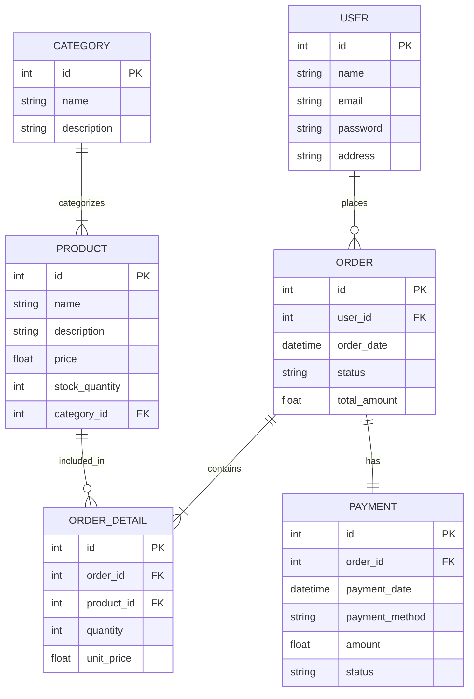

```mermaid
erDiagram
    USER {
        int id PK
        string name
        string email
        string password
        string address
    }

    PRODUCT {
        int id PK
        string name
        string description
        float price
        int stock_quantity
        int category_id FK
    }

    CATEGORY {
        int id PK
        string name
        string description
    }

    ORDER {
        int id PK
        int user_id FK
        datetime order_date
        string status
        float total_amount
    }

    ORDER_DETAIL {
        int id PK
        int order_id FK
        int product_id FK
        int quantity
        float unit_price
    }

    PAYMENT {
        int id PK
        int order_id FK
        datetime payment_date
        string payment_method
        float amount
        string status
    }

    USER ||--o{ ORDER : places
    ORDER ||--|{ ORDER_DETAIL : contains
    PRODUCT ||--o{ ORDER_DETAIL : included_in
    CATEGORY ||--|{ PRODUCT : categorizes
    ORDER ||--|| PAYMENT : has
```