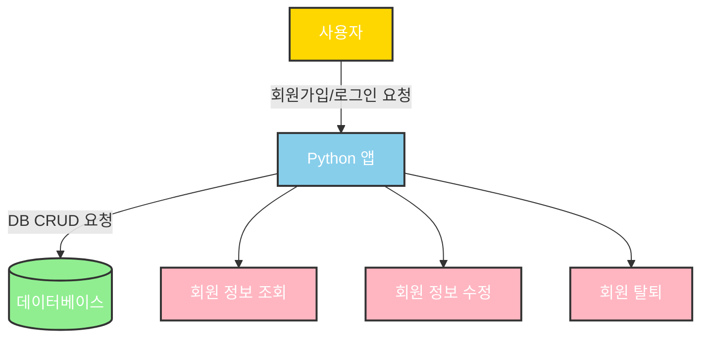

```mermaid
graph TD
    A[사용자] -->|회원가입/로그인 요청| B[Python 앱]
    B -->|DB CRUD 요청| C[(데이터베이스)]
    
    B --> D[회원 정보 조회]
    B --> E[회원 정보 수정]
    B --> F[회원 탈퇴]
    
    %% 색상과 글씨 색 지정
    style A fill:#FFD700,stroke:#333,stroke-width:2px,color:#FFFFFF
    style B fill:#87CEEB,stroke:#333,stroke-width:2px,color:#FFFFFF
    style C fill:#90EE90,stroke:#333,stroke-width:2px,color:#FFFFFF
    style D fill:#FFB6C1,stroke:#333,stroke-width:2px,color:#FFFFFF
    style E fill:#FFB6C1,stroke:#333,stroke-width:2px,color:#FFFFFF
    style F fill:#FFB6C1,stroke:#333,stroke-width:2px,color:#FFFFFF
```